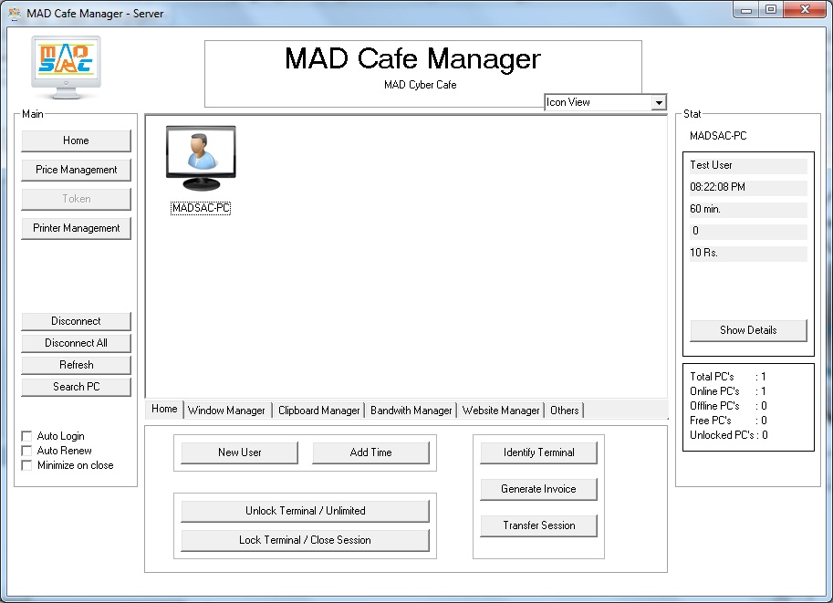
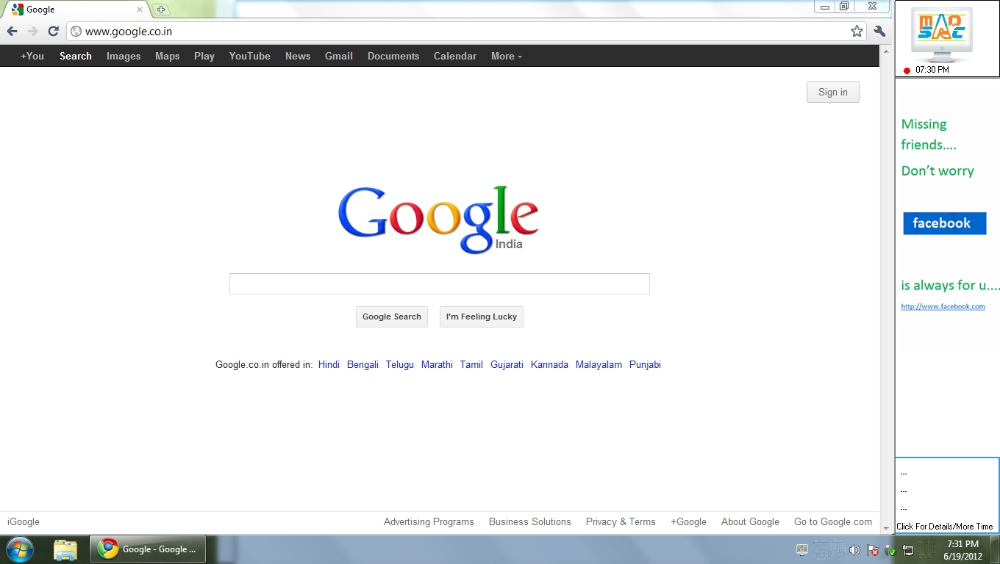
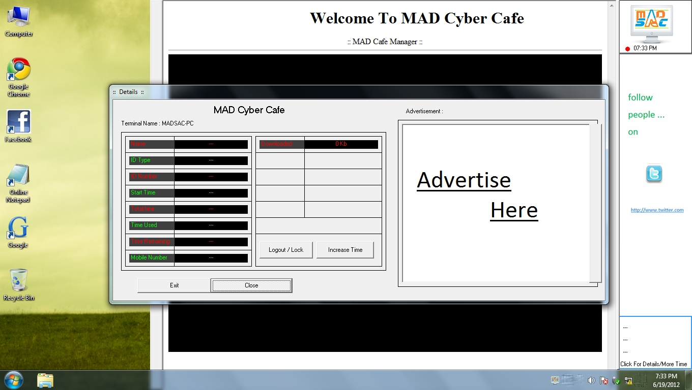
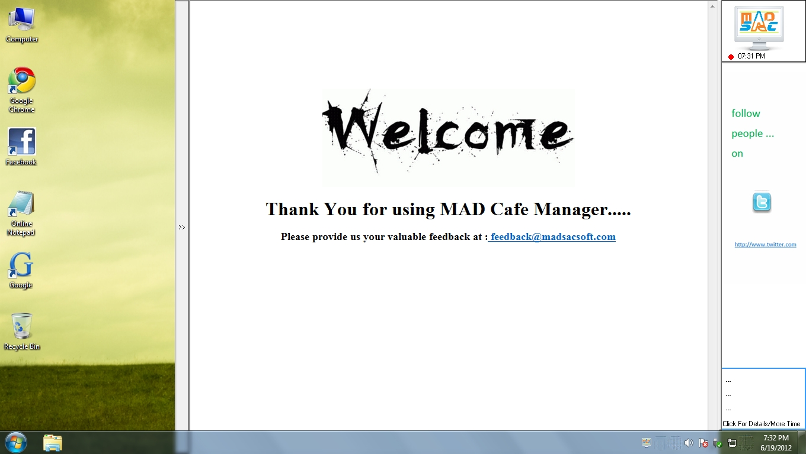

# Internet-Cyber Cafe Manager
An Internet cyber cafe management software written in VB6 which has almost all feature of a commerical grade cafe management system.

This project was developed in 2011-12 (when I was in  9th grade), I had very limited resources to write quality code. Still lots of code is reusable, incase anyone wants to use vb6.

# Highlights
This list has been created by recalling features by partial walkthrough of code. After 5 years, it's really hard to account for every feature, but I will try to be as precise as possible. 
Most of server code resides in [Server/winsck.frm](Server/winsck.frm).

- **System Dock** - A permanent notification panel can be placed on side of client machine, reducing work area but extending notification 
- **Custom Desktop Dock** - A facy dock which sticks to background image and can display any content. 
- **Minimum amount computation algorithm** - You can simply add desired rates like 5units for 10min, 15 for 20min, x,y,z amounts for different timing - the system will compute minimum amount for the user. [here](Server/winsck.frm#L3659)
- **No access Lock screen**
- **Network Statistics** Limit access based on bandwidth and data usage.
- **System Hacks** - Disable/Enable logoff,shutdown,restart, run, controlpanel, registry, taskmanager, Cancel shutdown,restart etc. Create system restore point.
- RDP - View the remote computer
- **Print Spool Management**
- Automatic node discovery using UDP broadcast.
- Encrypted tranfer of instruction over persistent TCP spool.
- Option for client to request for increasing time.
- Tranfer Session to different machine
- Token based access
- Prepaid and postpaid based access.
- Employee based access. 
- Add custom charges.
- System Logs
- Shutdown/Restart Unused System

# Spotlight 
I could find just 4 screenshots, I am adding them here.

Server:

Client:

# Closing note
This project was abandoned by me years ago - but if needed it can revived.

# License
[GPLv3](LICENSE)
